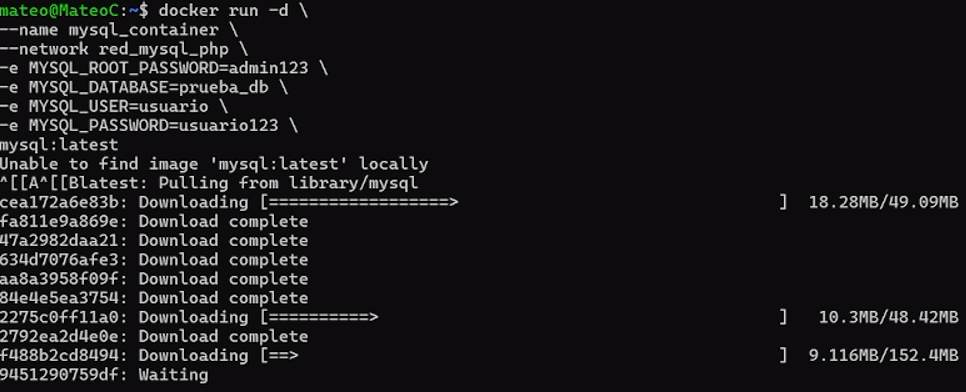
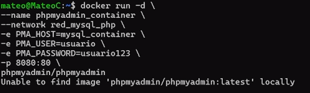
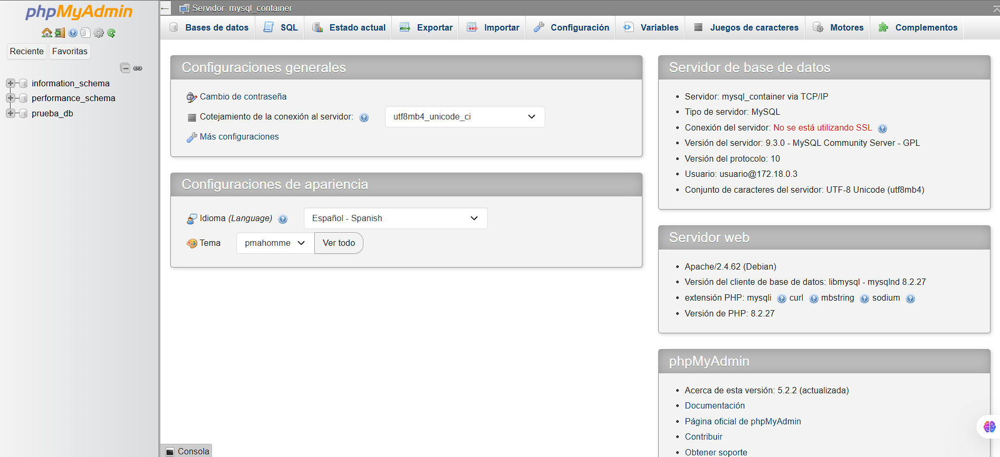
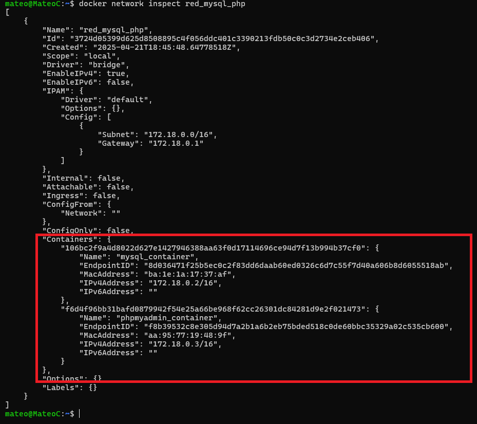

# Comunicación entre Contenedores MySQL y phpMyAdmin usando Docker

## 1. Título  
**Comunicación entre Contenedores MySQL y phpMyAdmin en una Red Personalizada con Docker**

## 2. Tiempo de duración  
**90 minutos**

## 3. Fundamentos

Esta práctica tiene como finalidad comprender la interconexión de contenedores utilizando Docker. Se implementó un contenedor con MySQL como servidor de base de datos y otro con phpMyAdmin como herramienta de gestión. La comunicación entre ambos se logró mediante una red personalizada de Docker, lo que permitió evitar la exposición innecesaria de puertos al exterior, reforzando así la seguridad y eficiencia en la gestión de servicios.

### Comandos utilizados

- `docker network create`: Para crear redes personalizadas.
- `docker run`: Para ejecutar contenedores.
- `docker ps`: Para administración de contenedores.
- `docker network inspect`: Para verificar qué contenedores están conectados a una red.


## 4. Conocimientos previos

- Conocimiento básico de Docker (contenedores, volúmenes, redes).
- Fundamentos de bases de datos relacionales.
- Uso básico de MySQL y phpMyAdmin.

## 5. Objetivos a alcanzar

- Crear un contenedor para MySQL con credenciales definidas.
- Crear un contenedor para phpMyAdmin.
- Crear una red personalizada en Docker.
- Conectar ambos contenedores a la red personalizada.
- Configurar phpMyAdmin para que acceda a MySQL mediante la red.
- Crear una base de datos de prueba desde la interfaz de phpMyAdmin.

## 6. Equipo necesario

- Computadora con Docker y WSL habilitado.
- Navegador web.
- Terminal compatible con Docker CLI.
- Conexión a Internet para descargar las imágenes oficiales.

## 7. Material de apoyo

- [Documentación oficial de Docker](https://docs.docker.com/)
- [phpMyAdmin Docs](https://docs.phpmyadmin.net/)
- [MySQL Docs](https://dev.mysql.com/doc/)

## 8. Procedimiento

### Paso 1: Crear red personalizada en Docker

```bash
docker network create red_mysql_php
```
<p align="center">
  
</p>

### Paso 2: Crear contenedor para MySQL

```bash
docker run -d \
  --name mysql_container \
  --network red_mysql_php \
  -e MYSQL_ROOT_PASSWORD=admin123 \
  -e MYSQL_DATABASE=prueba_db \
  -e MYSQL_USER=usuario \
  -e MYSQL_PASSWORD=usuario123 \
  mysql
```
<p align="center">
  
</p>


### Paso 3: Crear contenedor para phpMyAdmin

```bash
docker run -d \
  --name phpmyadmin_container \
  --network red_mysql_php \
  -e PMA_HOST=mysql_container \
  -p 8080:80 \
  phpmyadmin/phpmyadmin
```
<p align="center">
  
</p>


### Paso 4: Acceso a phpMyAdmin
En este caso declaramos las variables de entorno por lo que al abrir el gesto no requerira de contraseñas, en el caso que las variables no se declaren deberiamos seguir este proceso.

1. Abrir el navegador en `http://localhost:8080`
2. Ingresar:
   - Usuario: `usuario`
   - Contraseña: `usuario123`
3. Verificamos que se haya creado correctamente la base de datos `prueba_db`.


<p align="center">
  
</p>

## 9. Resultados

- La red personalizada `red_mysql_php` fue creada correctamente.


- phpMyAdmin logró conectarse exitosamente al contenedor de MySQL.
- Se accedió desde el navegador a la interfaz gráfica de phpMyAdmin.
- Se visualizó la base de datos `prueba`.
- Se pudo comprobar la conexión y funcionalidad mediante inserciones desde la interfaz.

<p align="center">
  
</p>

## 10. Conclusiones

Esta práctica permitió comprender cómo dos contenedores pueden comunicarse de forma eficiente mediante una red personalizada en Docker. Se observó que la variable `PMA_HOST` en phpMyAdmin es esencial para que el contenedor se conecte con el servidor de base de datos. También se concluyó que no es necesario exponer el puerto del contenedor de MySQL, lo que mejora la seguridad del entorno.

## 11. Bibliografía

Docker. (2024). *Docker Docs*. https://docs.docker.com/

IBM. (2025). Contenedores Docker y las interfaces de red en QRadar. IBM Documentation. https://www.ibm.com/docs/es/qsip/7.5?topic=qradar-docker-containers-network-interfaces

Miell, I., & Sayers, A. (2019). *Docker in practice*. Simon and Schuster.

MySQL. (2024). *MySQL 8.0 Reference Manual*. https://dev.mysql.com/doc/

Nickoloff, J., & Kuenzli, S. (2019). *Docker in action*. Simon and Schuster.

phpMyAdmin. (2024). *phpMyAdmin Official Documentation*. https://docs.phpmyadmin.net/
